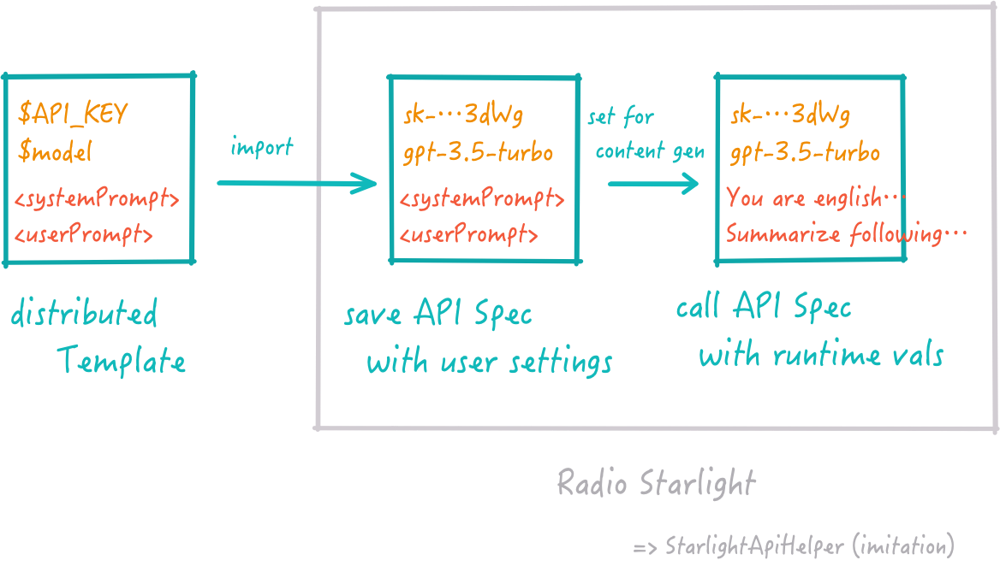

# User Guide for StarlightApiHelper

Welcome to the StarlightApiHelper! 

Currently [Radio Starlight](https://github.com/RayKitajima/RadioStarlight) uses OpenAI services to generate programmes, but the next release will introduce new functionality to create an API specification to connect to the generative AI services such as OpenAI, Anthropic, Local LMStudio, Dalle, Local ComfyUI and so on. 

StarlightApiHelper demonstrates how to handle the differences between various generative AI APIs within Radio Starlight. This guide explains how to create API specifications, make actual API calls, and verify their success.

You will learn to use StarlightApiHelper to create and manage API specifications and make API calls directly from your desktop application.

Please feel free to let me know how you use it and what you want to see in the next release of Radio Starlight.



## Getting Started

StarlightApiHelper is a SwiftUI application designed to simplify the process of creating, saving, and calling API specifications. 
Below are the primary functionalities provided by the application:

1. **Make API Spec**: Load JSON templates, apply user settings, and save the customized API specification.
2. **Call API Spec**: Load and utilize saved API specifications to make API calls and retrieve resources.

### Requirements

- macOS environment capable of running SwiftUI applications.
- Basic knowledge of JSON file handling.
- Familiarity with API concepts such as endpoints, headers, and methods.

## Part 1: Making an API Specification

This section guides you through creating an API specification from a JSON template.

### 1.1 Load JSON Template

1. **Start the Application**: Open the StarlightApiHelper on your Mac.
2. **Navigate to Create API Spec Tab**: This tab is intended for creating new API specs.
3. **Import JSON Template**:
   - Click the `Load` button under the "Select an API Spec template" section.
   - Select the JSON file from your local storage that you wish to use as a base for your API spec.

### 1.2 Apply User Settings

1. **Review Loaded JSON**: Once loaded, the JSON content will be displayed under the "Selected template" section.
2. **Edit Placeholders**: If the JSON template contains placeholders (e.g., `$placeholder`), these will appear under the "User settings" section.
   - Input the appropriate values for each placeholder in the provided text fields.

### 1.3 Save the Edited API Spec

1. **Save Your Spec**:
   - Once all placeholders are filled, click the `💾 Save API Spec` button.
   - Choose the destination on your local storage where you want to save the edited JSON file.

## Part 2: Calling an API Specification

This section explains how to use a saved API specification to make API calls.

### 2.1 Load Created API Spec

1. **Navigate to Call API Spec Tab**: Switch to the tab designed for API calls.
2. **Import API Spec**:
   - Click the `Load` button under the "Select an API Spec" section.
   - Select the API spec file from your local storage.

### 2.2 Apply User Value for the API Spec

1. **Set Application Parameters**: If the API spec requires additional parameters (e.g., user-specific data or dynamic values), input these in the respective fields under the "Simulate Application Parameters" section.

### 2.3 Call the API and Retrieve Resources

1. **Make the API Call**:
   - Click the `✨ Call API` button to initiate the API call.
   - The application will process the API spec and execute the call to the specified endpoint with the provided parameters.

### Results

- **View Results**: After calling the API, results will be displayed in the "Result" section.
  - For textual responses, the output will be shown as text.
  - For images encoded in base64, an image view will display the decoded image.


## Building the Project

To build the project, you need to clone the repo and create a copy of the included `.xcconfig` file to create your config before you can compile the project. **Otherwise, you will get an error.**

Here are the steps:

1. **Clone the repo:**
   ```sh
   git clone https://github.com/RayKitajima/StarlightApiHelper.git
   cd StarlightApiHelper
   ```

2. **Create your configuration file:**
   In the same folder that contains the `StarlightApiHelper.xcconfig.template`, run this command:
   ```sh
   cp StarlightApiHelper.xcconfig.template StarlightApiHelper.xcconfig
   ```

3. **Edit the configuration file:**
   Open `StarlightApiHelper.xcconfig` in your favorite text editor and fill in the `DEVELOPMENT_TEAM` and `BUNDLE_ID_PREFIX` values. 

   - `DEVELOPMENT_TEAM`: Your Apple Team ID (you can find this by logging into the Apple Developer Portal).
   - `BUNDLE_ID_PREFIX`: Your domain in reverse notation or whatever you use as the prefix for your projects (e.g., `com.example`).

   Example:
   ```plaintext
   DEVELOPMENT_TEAM = ABCDEFGHIJ
   BUNDLE_ID_PREFIX = com.example
   ```

4. **Save your changes**:
   Save the changes to `StarlightApiHelper.xcconfig`.

5. **Open the project in Xcode**:
   Open `StarlightApiHelper.xcodeproj` in Xcode.

6. **Build the project**:
   Select the target StarlightApiHelper and build it using the configured settings.

By following these steps, you should be able to compile the project without any issues. If you encounter any problems, please refer to the troubleshooting section or contact the project maintainers.

## Contribution

If you have any suggestions, feature requests, or bug reports, please feel free to create an issue on this repository. Your feedback is highly appreciated!
